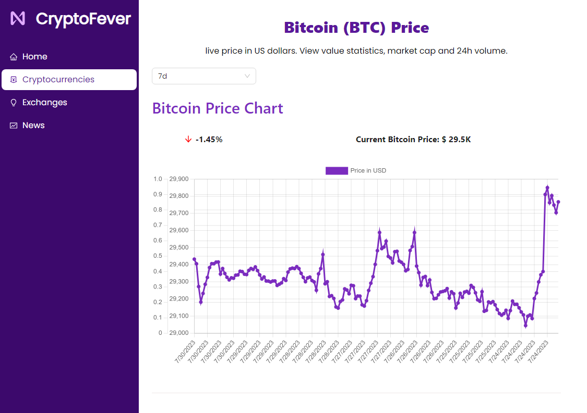
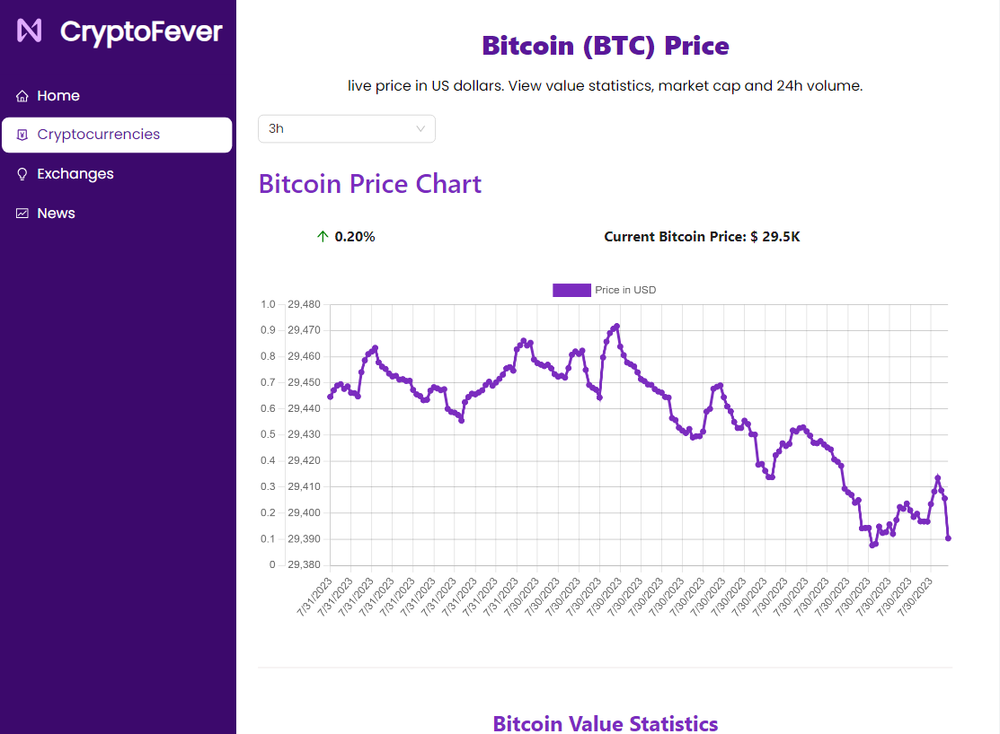

<h1>CryptoFever</h1>
<p><a href="https://crypto-fever.vercel.app/" target="_blank">Aplicação em funcionamento</a></p>

<p>Este é um projeto de uma aplicação web para visualização de informações sobre cryptocurrencies, com páginas para exibir dados sobre as principais cryptocurrencies por meio de APIs, exchanges e 
notícias relacionadas ao mercado de criptomoedas.</p>

<h2>Tecnologias Utilizadas</h2>
<ul>
<li>Vite.js: Ferramenta de desenvolvimento rápida para criar projetos React.</li>
<li>React: Biblioteca JavaScript para construção da interface do usuário.</li>
<li>HTML e CSS: Linguagens padrão para estruturação e estilização da aplicação.</li>
<li>Redux: Biblioteca para gerenciamento de estado global na aplicação.</li>
<li>Ant Design: Biblioteca de componentes visuais para React, fornecendo um conjunto de componentes prontos para uso.</li>
<li>API do Coinpaprika: API para obter informações detalhadas sobre cryptocurrencies.</li>
<li>API do Coinranking: API para acessar dados de mercado e estatísticas sobre cryptocurrencies.</li>
<li>Bing News Search API: API de busca de notícias do Bing para exibir notícias relacionadas ao mercado de criptomoedas.</li>
</ul>


<h2>Funcionalidades</h2>
<ul>
<li>Página Inicial (Home): Exibe uma visão geral das principais cryptocurrencies, status atual no mercado e noticias gerais.</li>
<li>Página Cryptocurrencies: Permite ao usuário visualizar detalhes de várias cryptocurrencies, como preço, gráficos e outras informações relevantes.</li>
<li>Página Exchanges: Apresenta uma lista de exchanges populares e suas informações relevantes.</li>
<li>Página Notícias (News): Exibe notícias recentes relacionadas ao mercado de criptomoedas.</li>
</ul>


<h3>Instalação e Execução</h3>

Certifique-se de ter o Node.js instalado em sua máquina.

Clone este repositório em seu ambiente local:
```bash
git clone git@github.com:LuizTzT/cryptoFever.git
```

Navegue até o diretório do projeto:

```bash
cd cryptoFever
```
Instale as dependências:
```bash
npm install
```
<br>
Será necessário a criação de uma key para realizar as requisições nas APIs.

Cria sua conta e gere sua key: https://rapidapi.com/

Modifique cada um dos cabeçalhos dos arquivos a seguir substituindo YOUR-KEY pelo código da sua chave:
```bash
coinPaprika.js
cryptoApi.js
cryptoExchangesApi.js
cryptoNewsApi.js
```
```bash
"X-RapidAPI-Key": "YOUR-KEY"
```

Inicie o servidor de desenvolvimento:

```bash
npm run dev
```

Acesse a aplicação em seu navegador(a porta pode variar):

```bash
http://localhost:3000
http://localhost:5173
```

<h2>Aplicação em funcionamento</h2>
<br>
<h3>Home stats</h3>


<h3>Home tablet stats</h3>


<h3>Home news</h3>


<h3>Home footer</h3>

<br>
<hr>
<br>
<h3>Cryptocurrencies</h3>


<h3>Cryptocurrencies search</h3>


<h3>Cryptocurrencies details</h3>

<br>
<hr>
<br>
<h3>CryptoDetails</h3>


<h3>CryptoDetails 3h search</h3>


<h3>CryptoDetails Statistics</h3>


<h3>CryptoDetails tablet</h3>


<h3>CryptoDetails tablet menu</h3>


<h3>CryptoDetails tablet statistics</h3>

<br>
<hr>
<br>
<h3>Exchanges</h3>


<h3>Exchanges info</h3>

<br>
<hr>
<br>
<h3>News</h3>


<h3>News search</h3>


<h3>News search result</h3>

